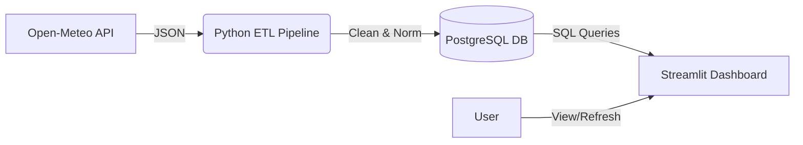

# 🌦️ Weather Data Pipeline


An end-to-end, containerized ETL pipeline that extracts weather data from the **Open-Meteo API**, processes it, and visualizes it via an interactive **Streamlit Dashboard**.

---

<details>
<summary>📖 Table of Contents</summary>

- [⚡ Features](#-features)
- [🏗️ Architecture](#️-architecture)
- [🚀 Quick Start](#-quick-start)
- [🖥️ Dashboard](#️-dashboard)
- [⚙️ Configuration](#️-configuration)
- [🛠️ Tech Stack](#️-tech-stack)
- [📂 Project Structure](#-project-structure)
- [🧪 Testing](#-testing)

</details>

---

## ⚡ Features

- **Automated ETL Pipeline**: Runs daily at 6:00 AM to fetch fresh weather forecasts.
- **Robust Data Cleaning**: Handles missing values, normalizes JSON, and ensures data integrity.
- **Database Storage**: Stores hourly and daily weather metrics in a structured PostgreSQL schema.
- **Real-Time Dashboard**: Visualize temperature trends, humidity, and pipeline status instantly.
- **Dockerized**: One command to spin up the entire stack (Database + Pipeline + Dashboard).
- **Manual Trigger**: "Refresh Data" button in the dashboard to fetch latest data on demand.

---

## 🏗️ Architecture



---

## 🚀 Quick Start

### Prerequisites

- **Docker** & **Docker Compose** installed.

### 1. Clone the Repository

```bash
git clone https://github.com/your-username/dataE.git
cd dataE
```

### 2. Configure Environment

Create a `.env` file (optional, defaults are provided):

```bash
cp .env.example .env
```

### 3. Launch the Stack

Run the following command to start the database, pipeline, and dashboard:

```bash
docker compose up --build -d
```

> The pipeline will run immediately upon startup to populate initial data.

---

## 🖥️ Dashboard

Once the containers are running, access the dashboard at:

👉 **[http://localhost:8501](http://localhost:8501)**

### What you'll see:

- **Top Metrics**: Current temperature, humidity, wind speed, and last pipeline status.
- **Interactive Charts**: Hourly temperature/humidity trends and daily precipitation.
- **Data Refresh**: Click the **🔄 Refresh Data** button to trigger a new API fetch instantly.

---

## ⚙️ Configuration

You can customize the pipeline via environment variables in `.env` or `docker-compose.yml`:

| Variable        | Default        | Description                                 |
| --------------- | -------------- | ------------------------------------------- |
| `API_LATITUDE`  | `30.0444`      | Latitude for weather data (Default: Cairo)  |
| `API_LONGITUDE` | `31.2357`      | Longitude for weather data (Default: Cairo) |
| `SCHEDULE_HOUR` | `6`            | Hour (0-23) when the daily job runs         |
| `DB_USER`       | `weather_user` | PostgreSQL username                         |
| `DB_PASSWORD`   | `weather_pass` | PostgreSQL password                         |

---

## 🛠️ Tech Stack

- **Lanuage**: Python 3.12
- **Orchestration**: Docker & Docker Compose
- **Database**: PostgreSQL 16
- **Visualization**: Streamlit & Altair
- **Scheduling**: APScheduler (Cron-like jobs)
- **Data Processing**: Pandas
- **API Client**: Requests

---

## 📂 Project Structure

```
dataE/
├── src/
│   ├── api_client.py       # Fetches data from Open-Meteo
│   ├── data_cleaning.py    # Normalizes JSON to DataFrame
│   ├── dashboard.py        # Streamlit App UI
│   ├── etl.py              # Main Pipeline Logic
│   ├── scheduler.py        # Daily Job Scheduler
│   └── db.py               # Database Connection Manager
├── sql/
│   └── schema.sql          # Database Tables & Schema
├── config/
│   └── settings.py         # App Configuration
├── tests/                  # Unit & Integration Tests
├── docker-compose.yml      # Service Definition
├── Dockerfile              # Container Image
└── requirements.txt        # Python Dependencies
```

---

## 🧪 Testing

To run the test suite locally:

1. Install dependencies:
   ```bash
   pip install -r requirements.txt pytest
   ```
2. Run tests:
   ```bash
   python -m pytest tests/ -v
   ```

---

Made with ❤️ by **Bilal Aboqura** & **Ahmed Mobarak** & **Ibrahim Zaghloul**
