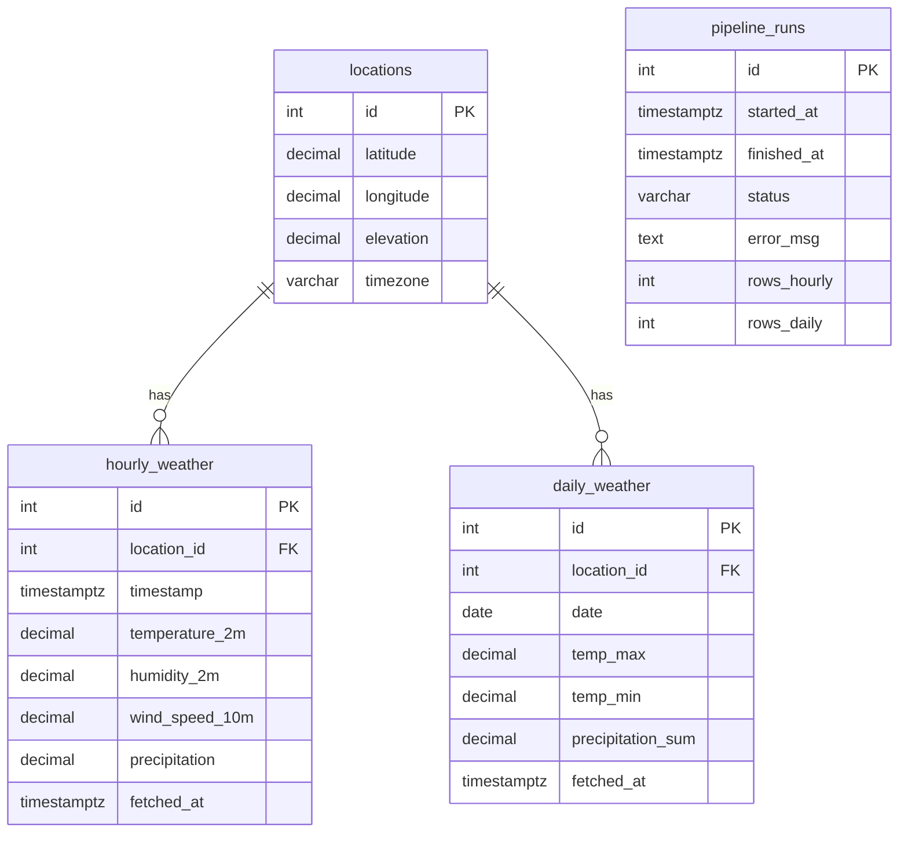

# Schema Design

## Entity-Relationship Diagram

## Table Descriptions

### `locations`

Stores unique geographic locations. One row per latitude/longitude pair.

| Column      | Type         | Constraint                | Description            |
| ----------- | ------------ | ------------------------- | ---------------------- |
| `id`        | SERIAL       | PK                        | Auto-increment ID      |
| `latitude`  | DECIMAL(8,5) | NOT NULL, UNIQUE(lat,lon) | Latitude               |
| `longitude` | DECIMAL(8,5) | NOT NULL, UNIQUE(lat,lon) | Longitude              |
| `elevation` | DECIMAL(7,2) | —                         | Elevation (m) from API |
| `timezone`  | VARCHAR(50)  | —                         | Timezone string        |

### `hourly_weather`

Hourly forecast observations linked to a location.

| Column           | Type         | Constraint               | Description              |
| ---------------- | ------------ | ------------------------ | ------------------------ |
| `id`             | SERIAL       | PK                       | Auto-increment ID        |
| `location_id`    | INT          | FK → locations, NOT NULL | Location reference       |
| `timestamp`      | TIMESTAMPTZ  | NOT NULL, UNIQUE(loc,ts) | Observation time         |
| `temperature_2m` | DECIMAL(5,2) | —                        | Temperature at 2m (°C)   |
| `humidity_2m`    | DECIMAL(5,2) | —                        | Relative humidity (%)    |
| `wind_speed_10m` | DECIMAL(6,2) | —                        | Wind speed at 10m (km/h) |
| `precipitation`  | DECIMAL(6,2) | —                        | Precipitation (mm)       |
| `fetched_at`     | TIMESTAMPTZ  | DEFAULT NOW()            | When data was fetched    |

### `daily_weather`

Daily aggregated summaries linked to a location.

| Column              | Type         | Constraint                 | Description              |
| ------------------- | ------------ | -------------------------- | ------------------------ |
| `id`                | SERIAL       | PK                         | Auto-increment ID        |
| `location_id`       | INT          | FK → locations, NOT NULL   | Location reference       |
| `date`              | DATE         | NOT NULL, UNIQUE(loc,date) | Observation date         |
| `temp_max`          | DECIMAL(5,2) | —                          | Max temperature (°C)     |
| `temp_min`          | DECIMAL(5,2) | —                          | Min temperature (°C)     |
| `precipitation_sum` | DECIMAL(6,2) | —                          | Total precipitation (mm) |
| `fetched_at`        | TIMESTAMPTZ  | DEFAULT NOW()              | When data was fetched    |

### `pipeline_runs`

Tracks each ETL execution for monitoring and debugging.

| Column        | Type        | Default     | Description                      |
| ------------- | ----------- | ----------- | -------------------------------- |
| `id`          | SERIAL      | PK          | Run ID                           |
| `started_at`  | TIMESTAMPTZ | NOW()       | Run start time                   |
| `finished_at` | TIMESTAMPTZ | —           | Run end time                     |
| `status`      | VARCHAR(20) | `'running'` | `running`, `completed`, `failed` |
| `error_msg`   | TEXT        | —           | Error details on failure         |
| `rows_hourly` | INT         | `0`         | Hourly rows upserted             |
| `rows_daily`  | INT         | `0`         | Daily rows upserted              |

## Indexing Strategy

| Index                      | Table          | Columns                  | Purpose                               |
| -------------------------- | -------------- | ------------------------ | ------------------------------------- |
| `idx_hourly_location_ts`   | hourly_weather | (location_id, timestamp) | Fast range queries by location + time |
| `idx_daily_location_date`  | daily_weather  | (location_id, date)      | Fast range queries by location + date |
| `idx_pipeline_runs_status` | pipeline_runs  | (status)                 | Filter runs by status                 |

## Upsert Strategy

All weather tables use `ON CONFLICT … DO UPDATE` to make the pipeline **idempotent** — running it multiple times for the same day simply updates existing rows rather than creating duplicates.
